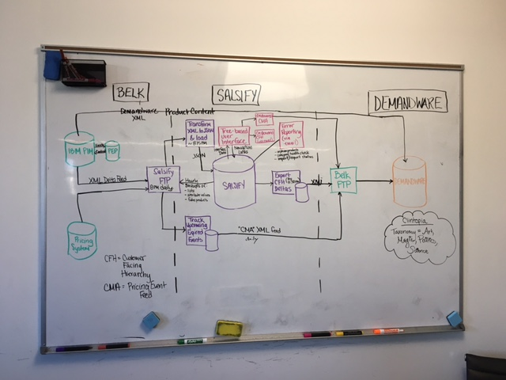

# Customer Belk

## CFH Integration

Production Org Id - `3562`

Development Org Id - `3573`

### Overall Flow


### Tasks

Rake tasks found in `cfh_scheduler.rake`

**CFH Tasks**

Note: all Salsify generated files are uploaded to Salsify FTP under `Customers/Belk/upload`.

`rake cfh:sync` - Triggers the CFH import/export job. Runs with an FTP listener that listens for up to 3 hours from `Customers/Belk/Belk/Prod/Catalog`

`rake cfh:import` - Triggers the CFH *import* only. Optionally takes a date argument.

`rake cfh:export` - Triggers the CFH *export* only. Takes cfh_execution_ids as arguments. Can run in full or delta mode depending on whether "yesterday's" cfh_execution_id has been provided. **NOTE** Ensure that a `SalsifyCfhExecution` `auto` object for the current day hasn't been created yet, and if it has, delete it before running this script!

`rake run_offline_cfh_feed` - Triggers the independent offline only cfh feed

**CMA Tasks**

`rake cma:run` - Triggers the CMA import/export job. Runs with an FTP listener that listens for up to 3 hours. Optionally takes a date argument. The FTP directory is `Customers/Belk/Belk/Prod/Price`

`rake cma:import_pricing_feed` - Triggers the CMA *import* only.

`rake cma:generate_cma_feed` - Triggers the CMA *export* only.

**Color Code**

During the `rake cfh:sync` job, we kick off a `GenerateColorCodeFeedJob` background job based on the SKUs provided in the Catalog delta. This job pulls NRFColorCode info from the CARS organization and serializes the data to a CSV that is uploaded to FTP at `Customers/Belk/Belk/Prod/Color Code`

`rake import_color_code` is a scheduled task that listens for the aforementioned CSV file, extracts relational information from the CFH organization, and serializes the data to an XML file that is uploaded to Belk FTP.

If a Color Over Key feed needs to regenerated:

1. Move the applicable catalog_delta file from the `Catalog Archive` to the `Catalog` FTP directory.
2. Run the export_color_codes rake task: `heroku run rake cfh:export_color_codes[Catalog_Delta_20180102_1809.tar.gz]`
3. Once the `GenerateColorCodeFeedJob` delayed job is finished, ensure that a file in the `Color Code` FTP directory has been created.
4. Run the import_code_code rake task: `heroku run rake import_color_code[2017-04-24]`

**RRD Tasks**

`rake rrd:send_asset_feed_to_rrd` - Sends all images in the 'RRD - Outgoing assets' list to RRD via FTP.  Also generates two xml files notifying RRD of these new images as well as deleted images (uses RrdDeletedImage rails model).  Clears outgoing assets list and RrdDeletedImage records when done.

`rake rrd:check_rrd_for_processed_assets` - Checks the RRD FTP for response xml files indicating image pass/fail, and parses messages from them and applies these messages as metadata on the images in Salsify.

`rake rrd:process_rrd_vendor_image_histories` - Checks the RRD FTP for image history files indicating images which have been approved and sent from RRD to Belk.  When all of a product's images which have been sent to RRD have been approved, we generate a task ID (RrdTaskId rails model) and apply it to the related Salsify product if it doesn't already have one.  We use the RrdImageHistory rails model to track images which have been approved by RRD since the history files may only contain a subset of a product's images.

`rake rrd:send_sample_requests_to_rrd` - Looks in rails database for RrdRequestedSample records with the sent_to_rrd flag = false.  These records are created via the RRD page on the Belk Heroku app.  Pulls product information out of Salsify and sends an xml file (and excel copy) to RRD notifying them of Belk's sample photo requests.  Flags the RrdRequestedSample records as sent_to_rrd = true when done.

`rake rrd:check_rrd_for_processed_samples` - Checks the RRD FTP for sample image history files indicating sample photos which have been processed and sent to Belk.  When a sample's history indicates it's arrived at Belk, we mark the RrdRequestedSample.completed_at timestamp and generate a task ID (RrdTaskId) for the related product if one doesn't exist yet.

`rake rrd:image_feed` - Runs all of the above RRD rake tasks in order.  To be run daily.

`rake rrd:send_belk_hex_feed` - Pulls all Salsify products from the 'Products with Hex Color' list and creates a txt file with their vendor number, style number, color name, and hex color.  Sends this txt file to Belk via FTP.

**Other Tasks**

`rake clean:database` - Removed stale events, cfh_execution and associated salsify_sql_nodes

`rake import_inventory` - Imports inventory content

`rake import_color_code` - Triggers color code import/export job

`rake update_list_filters` - Updates all simple lists to ensure they have specific filters

`rake locate_orphaned_products` - Populates the `Unorphaned List` in Salsify which powers the `Orphaned List`. Belk uses this to determine which Styles they still need to categorize.

### Schedule Summary

```
4:00am - rake clean:database
8:00am - rake import_inventory
6:30pm - rake cfh:sync
9:00pm - rake cma:run
7:00pm - rake import_color_code
9:00pm - rake run_offline_cfh_feed
```

### Reporting

#### Category Heath Check
This report compares lists, category metadata, and the category hierarchy to find any mismatches.

`bundle exec rake generate_health_check_reporting`


## CARS Integration

QA Org Id - `5041`

Production Org Id - `5787`

### Tasks

Rake tasks found in `pim_import.rake`

`rake run_pim_import` - Imports PIM Delta feed into Salsify. Currently a WIP that isn't automated.

### PIM Import TODO

* Belk to send over attribute mapping -- this will hopefully contain enumerated registries
* How to add multiple dynos on worker?

### Other TODO

* Color code overkey logic

## RRD Integration

Development Org Id - `5041`

### Tasks

Rake tasks found in `lib/tasks/rrd_tasks.rake`, also described above.

### Notes

There are two key parts of the RRD integration, Salsify image uploads and sample photo requests.

When images are uploaded to Salsify and attached to a SKU (child product) on a predetermined set of properties, it will trigger a webhook which identifies the new image(s) and stores product info on the image as metadata.  Specifically, a JSON hash is stored as metadata on the asset keyed on the product's (vendorNumber + styleNumber + '\_' + colorCode), and will store the RRD image ID, RRD file name, and flag for whether it needs to be sent to RRD.  For example, an image on two different colored skus might look like this if it's already been sent to RRD for one color but not the other:

```
{
  '12345612345_101': {
    'rrd_image_id': 1000001,
    'filename': '123456_12345_A_101.jpg',
    'sent_to_rrd': true
  },
  '12345612345_102': {
    'rrd_image_id': 1000002,
    'filename': '123456_12345_A_102.jpg',
    'sent_to_rrd': false
  }
}
```

The RRD filename combines the parent product's vendorNumber and styleNumber, then the shot type (determined by which property the image is on on the SKU), and then the SKU's color code.  There are also group products which have no parent/child, in which case we use that product's ORIN number in place of the styleNumber, and 000 for the color code, as these products have no color code.

#### Step 1: Notify RRD of images
When the webhook detects the addition of the image on a new SKU and updates this metadata, it will add the image to a list of images to be sent to RRD.  On a scheduled basis, a script will look at all images on that list and send any "versions" of the image (items in the image's metadata hash) with sent_to_rrd = false to RRD's ftp server, and notify RRD of the created images via an xml feed.

We also track image deletions via a webhook, and notify RRD of deleted images via a second xml feed.

#### Step 2: Retrieve feedback from RRD
On a scheduled basis, we check RRD's ftp server for feedback xml files.  We parse the files, which specify image pass/fail and provide reasons for failures.  We then apply the feedback as metadata on the Salsify asset.

#### Step 3: Check for all images approved
We also check RRD for image approval history files, which indicate when an image has been approved and passed on to Belk from RRD.  When all of a product's images have been approved by RRD, we'll generate a task ID (using the RrdTaskId rails model, which ties to a Salsify product ID) and apply it to the parent product.  The purpose of this task ID is for Belk users to enter into their Adobe Bridge tool, which will pull information about the Salsify product family.

#### Step 4: Requesting sample photos
Belk users can go to the `/rrd` endpoint of Salsify's Belk heroku app (currently https://customer-belk-dev.herokuapp.com) to request sample photos.  Sample photos are when Belk has no images for a product, and will instead send a physical sample of the product to RRD for them to photograph and provide images to Belk.  Users can go to this page of the heroku app, enter a Salsify parent product ID, and select which color options they want to request samples for.  This will use the RrdRequestedSample rails model, which will be collected and sent to RRD on a scheduled basis (for those that haven't been sent yet) as an xml feed.

#### Step 5: Retrieving sample responses
On a scheduled basis, we check RRD for sample request responses.  When a sample request is completed, RRD sends the created images to Belk's image server, and we will create a task ID for the parent product if it doesn't already have one.
